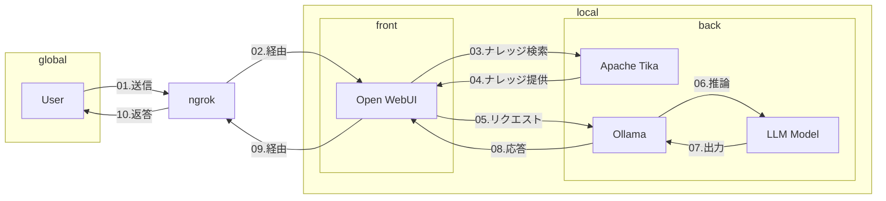
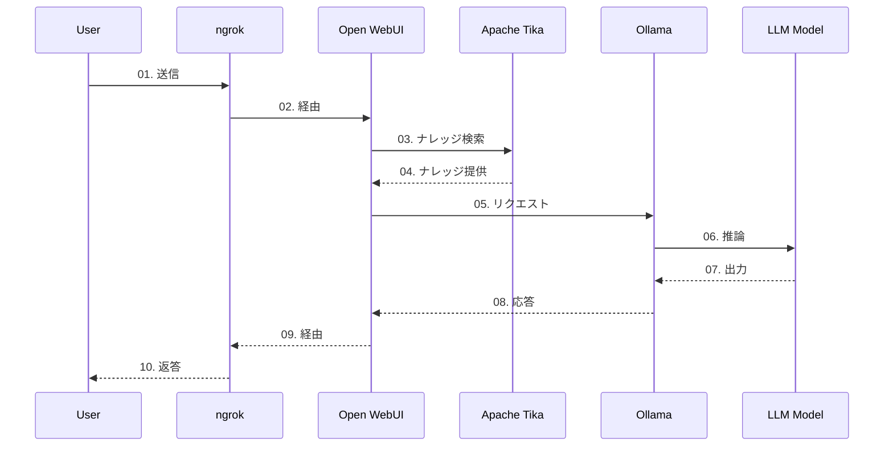
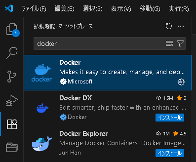
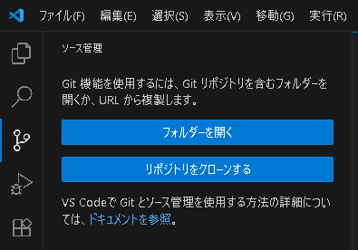
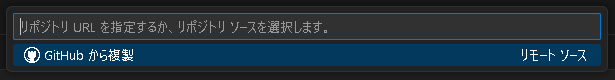
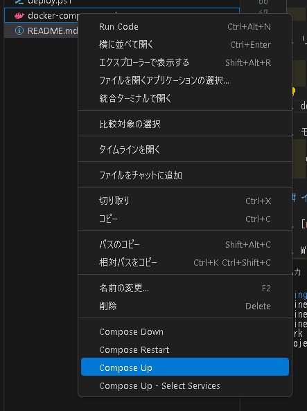
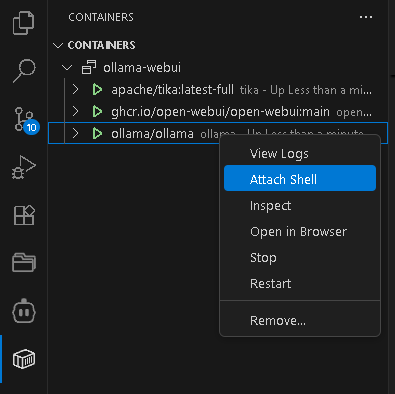

## アーキテクチャ図



## シーケンス図



## セットアップ

1. [Docker](https://www.docker.com/ja-jp/products/docker-desktop/)をインストール

1. [VSCode](https://code.visualstudio.com/)をインストール

1. VSCodeにDockerの拡張機能をインストール

    

1. リポジトリをクローン

    
    

1. docker-compose.yamlを右クリックし、Compose Upを選択

    

1. shellを開く

    

1. モデルのダウンロード（[モデルの一覧](https://ollama.com/library)）
    ```
    ollama pull <model_name>
    ```

1. https://localhost:3000 にアクセス

## インターネットに公開

1. [ngrok](https://ngrok.com/)のアカウントを作成

1. WinGetを使用してngrokをインストール
    ```
    winget install ngrok -s msstore
    ```

1. ngrokの認証
    ```
    ngrok config add-authtoken <your_auth_token>
    ```

1. ローカルサーバーを公開
    ```
    ngrok http localhost:3000
    ```

## 参考サイト

- ローカルLLMの使用 - OllamaとOpen WebUIの連携について解説  
https://qiita.com/RyutoYoda/items/ecdfbef8c73aae64aa45

- LLM推論マシンの環境構築メモ(ollama open-webui ubuntu2204)
https://qiita.com/katakaku/items/eb807594ea9f1ec425d3

- ローカルLLMを外部PC/スマホで！【ngrok＋Open WebUI+Ollama】
https://note.com/josh_/n/n74b7cc0fdd1a
